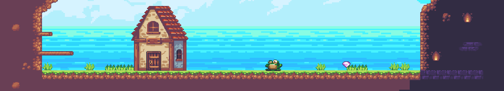

<p align="center">
    
</p>

# Incaribus

## Description
This project provide an example designed with [ShipWreck](https://docs.creative-rift.com/) Engine.
You follow a little fox and travel around the world to collect all gems. </br>
WARNING: This project may contain experimental feature. 
Please if an issue occur, report them on the [issue tracker](https://github.com/Creative-Rift/Incaribus/issues).

## Compilation

To build the project simply use these commands:

```bash
mkdir build ; cd build
cmake -G "Visual Studio 17 2022" -DCMAKE_BUILD_TYPE=[Debug/Release] ..
cmake --build . --target Incaribus --config [Debug/Release]
```

The output program will be in `Incaribus/out/[Debug/Release]/incaribus.exe` \
PS: Run the game directly from the folder, or resources will not be found.

# Asset Pack

In this project we use the awesome [Sunny Land](https://ansimuz.itch.io/sunny-land-pixel-game-art) asset pack.

## Author

Made on our ship with :heart: \

[Guillaume Soisson](https://github.com/Alvarwow69)
